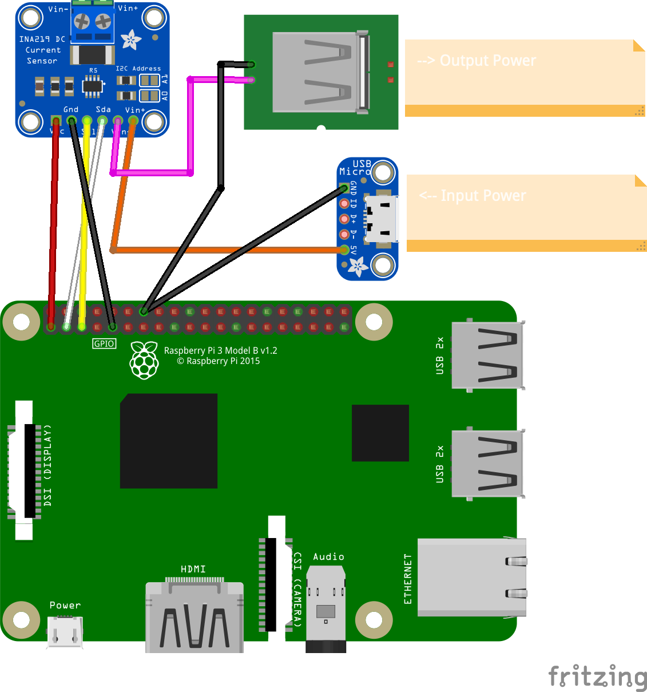

# Python RPi INA219 Voltage and Current Monitor
A script written to be used on a Raspberry Pi (RPi) with an INA219 connected by I2C to read the voltage, shunt current, power. *Note: the ground wire from the input power was connected to the INA219 ground so the voltage could also be pulled. 

**[Output CSV File]** The output file will be named "powerlog-[timestamp].csv" and will be created in the working directory. - [Example file](Example-output-file.csv) 

